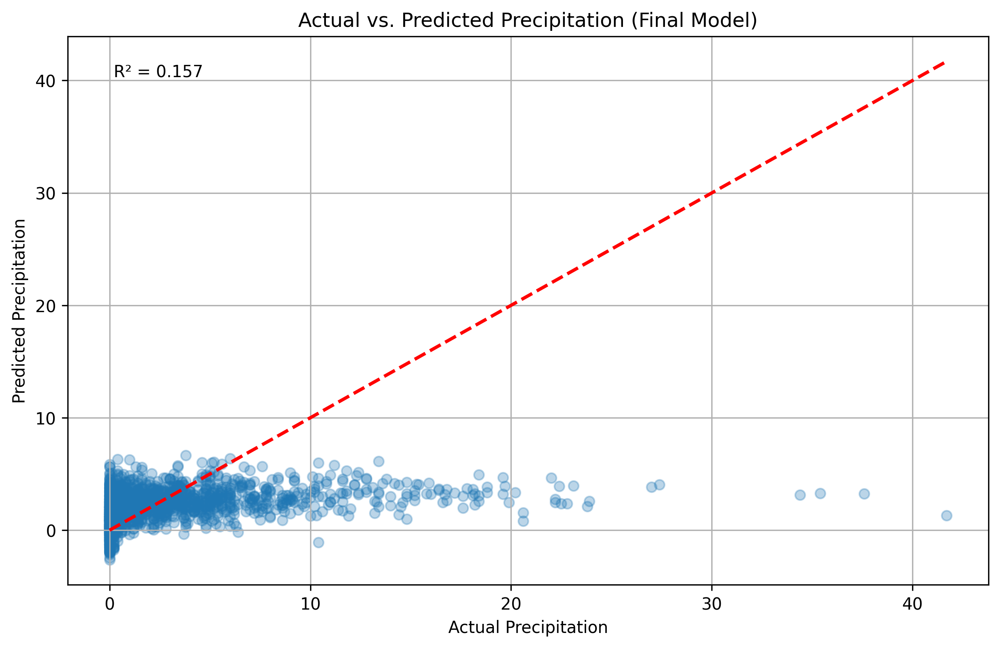

# Weather Precipitation Prediction

A machine learning project investigating the prediction of daily precipitation using historical London weather data and linear regression.

## Overview

This project explores whether historical weather variables can be used to predict daily precipitation.

A baseline Linear Regression model was developed and then evaluated through a series of preprocessing and feature-engineering experiments, including:

- Feature transformation
- Correlation-based feature selection
- Statistical outlier detection
- Model performance comparison

The final model was evaluated using the coefficient of determination (R²).

## Dataset

The project uses historical London weather data containing weather measurements such as:

- Cloud cover
- Sunshine
- Global radiation
- Maximum temperature
- Mean temperature
- Minimum temperature
- Atmospheric pressure
- Snow depth
- Precipitation

After removing rows containing missing values, the dataset contained 13,843 observations across 10 columns.

## Methodology

### 1. Data Preparation

The dataset was loaded using Pandas and rows containing missing values were removed.

The date column was excluded from the predictive features, while precipitation was used as the target variable.

### 2. Train/Test Split

The dataset was divided into training and testing sets using an 80/20 split with a fixed random state for reproducibility.

### 3. Baseline Model

A Linear Regression model was trained on the original feature set to establish a baseline for comparison.

### 4. Feature Transformation

Three transformation approaches were evaluated:

- Min-Max scaling
- Row-wise normalization
- Z-score standardization

The transformation producing the highest R² score was selected for subsequent analysis.

### 5. Feature Selection

Pearson correlation was used to identify highly correlated features.

Multiple correlation thresholds were evaluated:

- |r| > 0.9
- |r| > 0.8
- |r| > 0.7

The resulting models were compared using R².

### 6. Outlier Detection

Column-wise Z-scores were calculated using the training data.

Multiple outlier-detection configurations were evaluated by varying:

- Z-score threshold
- Minimum number of columns containing outlier values

The best-performing configuration was selected for the final model.

## Results

| Experiment | R² |
|---|---:|
| Baseline Linear Regression | 0.162019 |
| Best Transformation — Min-Max | 0.162019 |
| Feature Selection | 0.156766 |
| Best Outlier Strategy | 0.156766 |
| **Final Model** | **0.156766** |

### Key Finding

The preprocessing techniques tested did not improve upon the baseline Linear Regression model.

Min-Max scaling produced the same performance as the baseline, while feature selection resulted in a small decrease in R². Outlier detection did not produce a further improvement.

This suggests that the relationship between the available weather variables and precipitation is not well captured by the current linear model.

## Visualization

### Actual vs. Predicted Precipitation

The final model's predictions are compared against the observed precipitation values.



The visualization shows that the model tends to produce predictions within a relatively narrow range and has difficulty capturing larger precipitation values.

## Limitations

The final model achieved an R² of approximately 0.157, indicating that it explains only a limited proportion of the variation in precipitation.

Possible factors include:

- The nonlinear nature of precipitation patterns
- Limited predictive information in the selected features
- The highly variable distribution of precipitation
- The use of Linear Regression as the predictive model

## Future Improvements

Future work could investigate:

- Nonlinear regression models
- Random Forest and Gradient Boosting models
- Additional weather and temporal features
- Feature engineering based on seasonal patterns
- Alternative approaches to handling the precipitation distribution
- Additional evaluation metrics such as MAE and RMSE

## Technologies

- Python
- Pandas
- NumPy
- Scikit-learn
- Matplotlib
- Jupyter Notebook

## Project Structure

```text
weather-precipitation-prediction/
│
├── README.md
├── weather_precipitation_prediction.ipynb
├── london_weather.csv
├── actual_vs_predicted.png
├── requirements.txt
└── .gitignore
